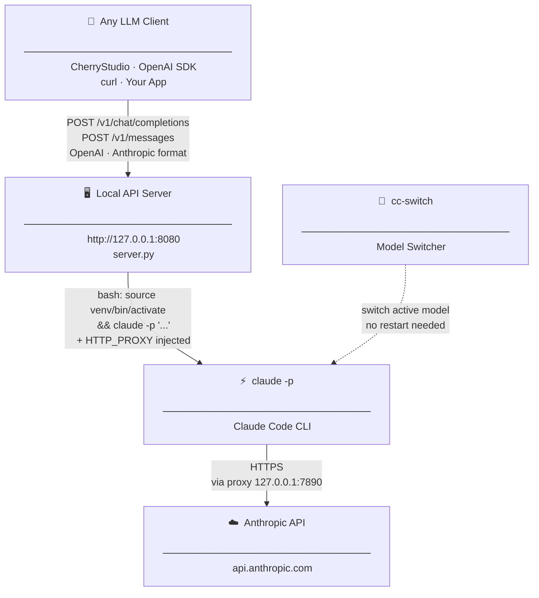
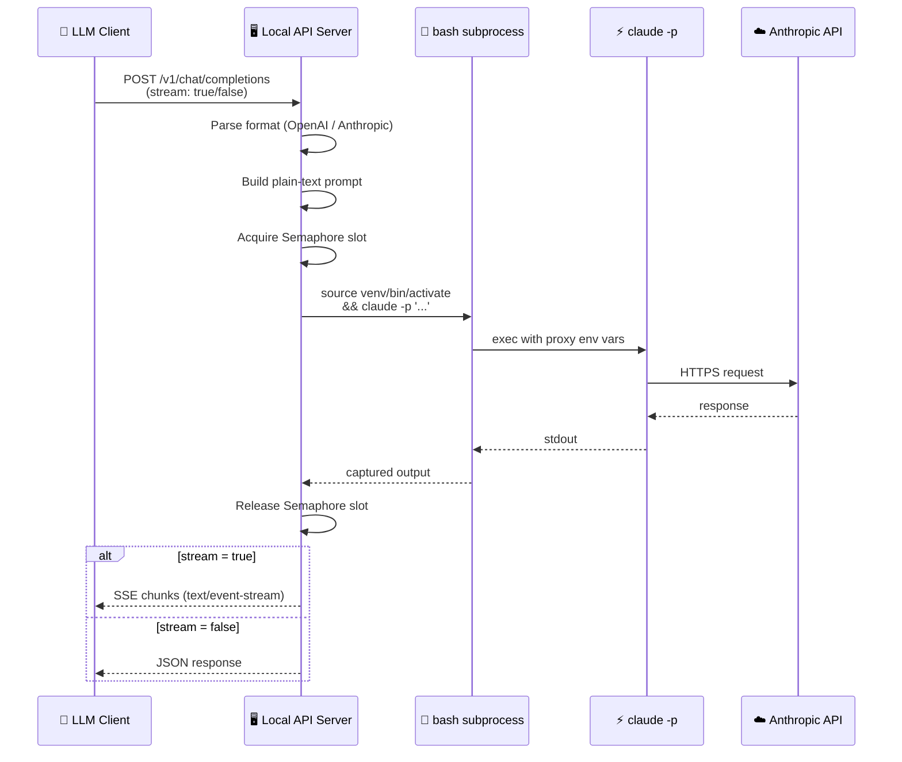
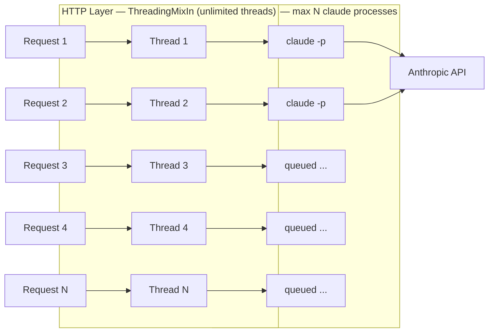
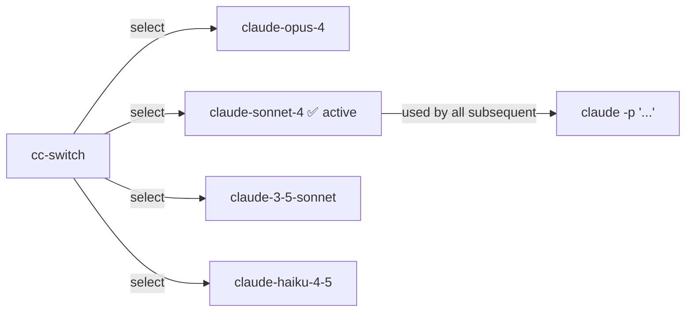

# AnyClaw

By wrapping up claude code(claude -p) and standing on the shoulders of giants, you can use any model with [cc-switch](https://github.com/farion1231/cc-switch).


# Claude CLI — Local API Wrapper

> Wrap any LLM client around `claude -p`

---

## Architecture



---

## Request Flow



---

## Concurrency Model



---

## Model Switching with `cc-switch`



> Switch once → every following `claude -p` call uses the new model automatically. No server restart required.

---


# Claude Local API Server

A local API server that wraps the `claude -p` CLI, exposing both **OpenAI-compatible** and **Anthropic-compatible** HTTP endpoints. Designed to work with clients like [CherryStudio](https://github.com/kangfenmao/cherry-studio), `curl`, or any OpenAI SDK.

## Features

- **OpenAI format** — `POST /v1/chat/completions` (streaming + non-streaming)
- **Anthropic format** — `POST /v1/messages` (streaming + non-streaming)
- **Model list** — `GET /v1/models`
- **Stats** — `GET /v1/stats`
- **Health check** — `GET /health`
- Concurrent requests via `ThreadingMixIn` + `Semaphore` queue
- Automatic proxy injection (`http_proxy`, `https_proxy`, `all_proxy`)
- Optional virtualenv activation before each `claude` call
- Graceful forced exit on `Ctrl+C` / `SIGTERM`
- Zero third-party dependencies (Python stdlib only)

## Requirements

- Python 3.10+
- [Claude Code CLI](https://docs.anthropic.com/en/docs/claude-code) installed and authenticated

```bash
npm install -g @anthropic-ai/claude-code
claude --version   # verify
```

## Usage

```bash
# Default: 127.0.0.1:8080, proxy=127.0.0.1:7890, venv=nano_env
python server.py

# Custom options
python server.py --host 0.0.0.0 --port 11434 --workers 4 --timeout 180

# Disable proxy
python server.py --proxy ""

# Disable virtualenv
python server.py --venv ""

# Custom virtualenv path
python server.py --venv /home/user/myenv
```

### All Arguments

| Argument | Default | Description |
|----------|---------|-------------|
| `--host` | `127.0.0.1` | Bind address |
| `--port` | `8080` | Bind port |
| `--timeout` | `120` | Per-request claude timeout (seconds) |
| `--workers` | `8` | Max concurrent claude processes |
| `--proxy` | `http://127.0.0.1:7890` | Proxy URL, empty string to disable |
| `--venv` | `nano_env` | Virtualenv path, empty string to disable |

## Endpoints

### `POST /v1/chat/completions` — OpenAI format

```bash
curl http://127.0.0.1:8080/v1/chat/completions \
  -H "Content-Type: application/json" \
  -d '{
    "model": "claude-local",
    "stream": false,
    "messages": [
      {"role": "system", "content": "You are a helpful assistant."},
      {"role": "user",   "content": "What is recursion?"}
    ]
  }'
```

### `POST /v1/messages` — Anthropic format

```bash
curl http://127.0.0.1:8080/v1/messages \
  -H "Content-Type: application/json" \
  -d '{
    "model": "claude-local",
    "system": "You are a helpful assistant.",
    "messages": [{"role": "user", "content": "What is recursion?"}]
  }'
```

### `GET /v1/models`

```bash
curl http://127.0.0.1:8080/v1/models
```

### `GET /v1/stats`

```bash
curl http://127.0.0.1:8080/v1/stats
# {"max_workers": 8, "total": 42, "active": 2, "errors": 0, "queued": 1}
```

### `GET /health`

```bash
curl http://127.0.0.1:8080/health
```

## CherryStudio Setup

1. Go to **Settings → Model Providers → Add**
2. Set **Type** to `OpenAI Compatible`
3. Set **API URL** to `http://127.0.0.1:8080`
4. Set **API Key** to any string (e.g. `sk-local`) — not validated
5. Click **Get Models** or manually enter `claude-local`
6. Click **Test Connection** — should show ✅

## Python (OpenAI SDK)

```python
from openai import OpenAI

client = OpenAI(
    api_key="sk-local",
    base_url="http://127.0.0.1:8080/v1"
)

resp = client.chat.completions.create(
    model="claude-local",
    messages=[{"role": "user", "content": "Hello!"}]
)
print(resp.choices[0].message.content)
```

## Architecture

```
HTTP Request
    │
    ▼
ThreadedHTTPServer  (one thread per request)
    │
    ▼
Semaphore  (queue when > max workers)
    │
    ▼
/bin/bash -c "source <venv>/bin/activate && claude -p '<prompt>'"
             + proxy env vars injected
```

## License

MIT
